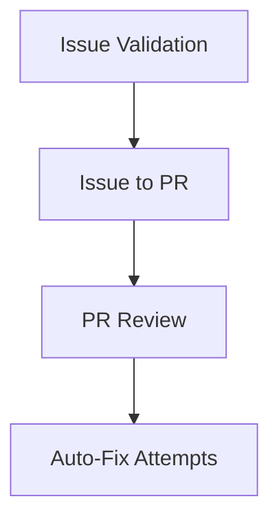

## Automated Workflow Diagram

```mermaid
graph TD
    A[Issue Validation] --> B[Issue to PR]
    B --> C[PR Review]
    C --> D[Auto-Fix Attempts]
```

This diagram illustrates the current automated flow for issue processing and PR handling in the repository.