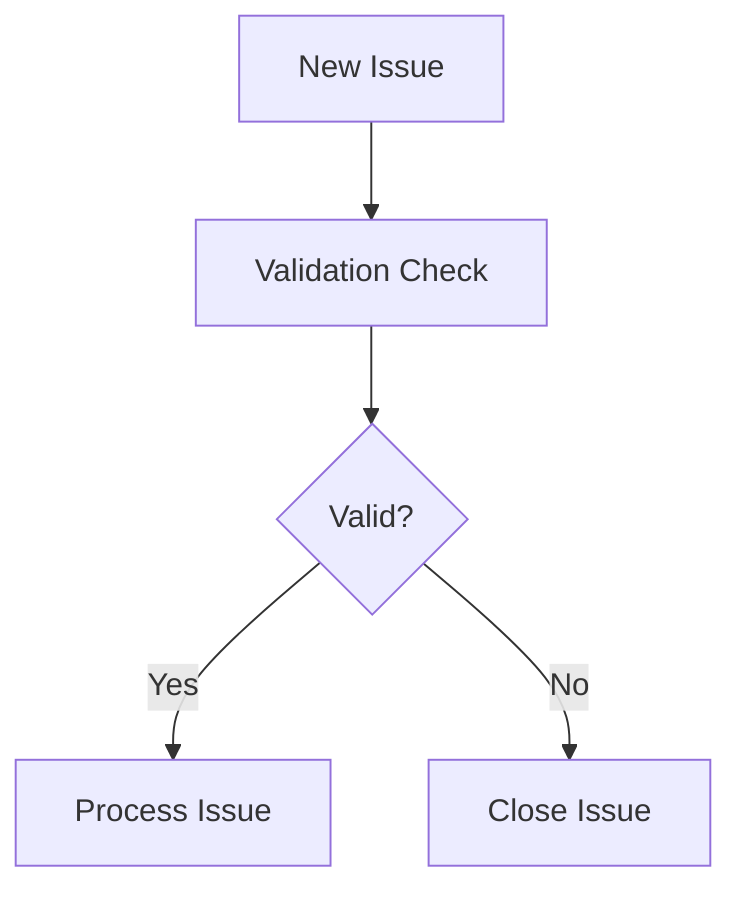
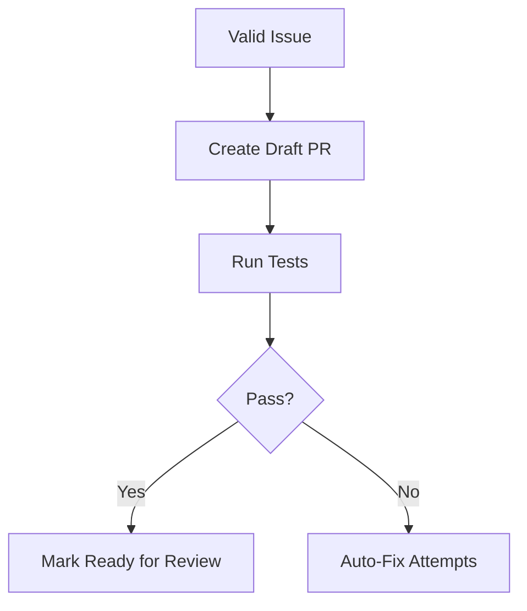
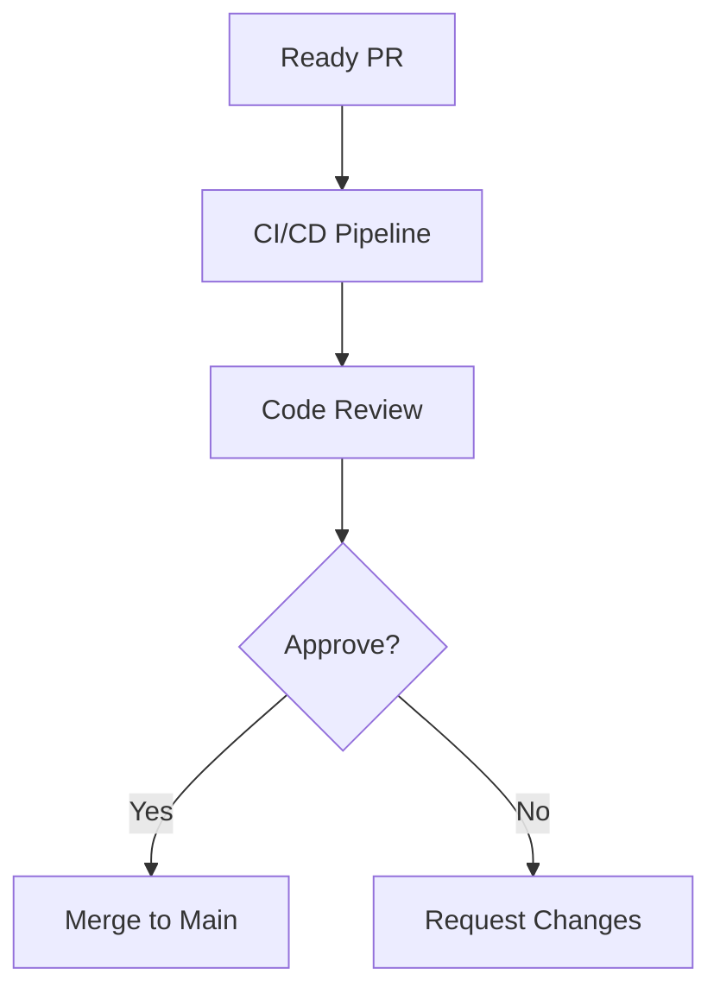
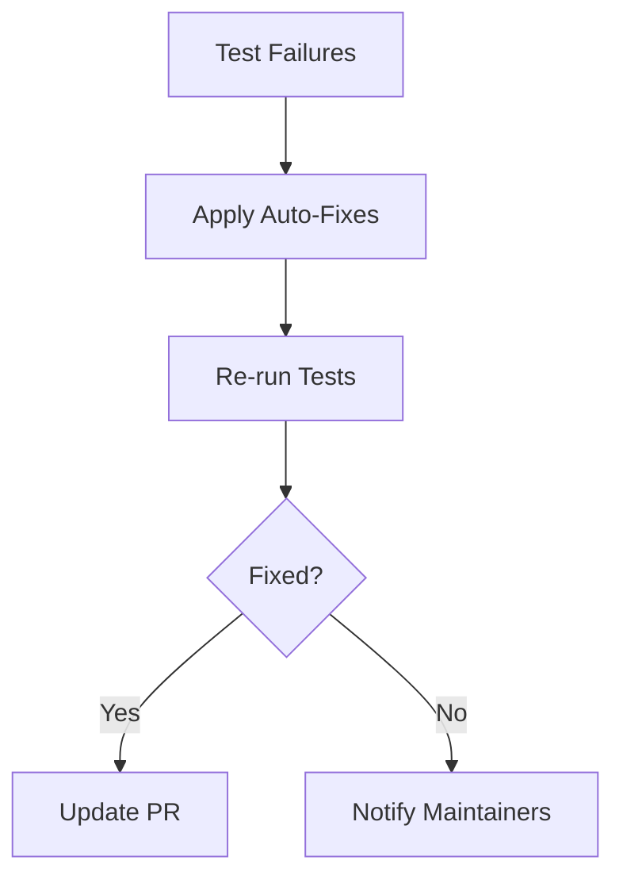

# Autonomous Dev Loop

## 🔄 Automated Workflows

### Issue Validation

```mermaid
graph TD
    A[New Issue] --> B[Validation Check]
    B --> C{Valid?}
    C -->|Yes| D[Process Issue]
    C -->|No| E[Close Issue]
```

### Issue to PR

```mermaid
graph TD
    F[Valid Issue] --> G[Create Draft PR]
    G --> H[Run Tests]
    H --> I{Pass?}
    I -->|Yes| J[Mark Ready for Review]
    I -->|No| K[Auto-Fix Attempts]
```

### PR Review

```mermaid
graph TD
    L[Ready PR] --> M[CI/CD Pipeline]
    M --> N[Code Review]
    N --> O{Approve?}
    O -->|Yes| P[Merge to Main]
    O -->|No| Q[Request Changes]
```

### Auto-Fix Attempts

```mermaid
graph TD
    R[Test Failures] --> S[Apply Auto-Fixes]
    S --> T[Re-run Tests]
    T --> U{Fixed?}
    U -->|Yes| V[Update PR]
    U -->|No| W[Notify Maintainers]
```