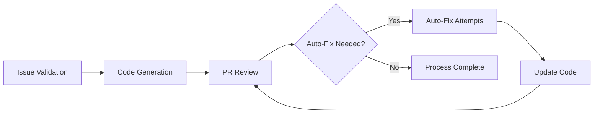

# autonomous-dev-loop

[](https://github.com/koydas/autonomous-dev-loop/actions/workflows/test.yml)

A fully autonomous GitHub-native dev loop: Issue → AI coder → PR → AI reviewer → iterative loop → human merge gate.

## MVP Automation Implemented

The MVP issue-to-PR automation is now implemented. The default AI provider is **Groq** (`qwen/qwen3-32b`); Anthropic (Claude) is also supported via `AI_PROVIDER` when both provider keys are configured.

- Workflow: `.github/workflows/code-generation.yml` (kept minimal/orchestration-only)
- Generator script: `scripts/generate_issue_change.mjs`
- Generator modules: `scripts/lib/*.mjs`
- Prompt files: `prompts/*.md` (one file per prompt, loaded at runtime)
- Setup and testing guide: `docs/code-generation.md`
- MVP definition: `docs/mvp.md`

See `docs/code-generation.md` for required secrets (`ANTHROPIC_API_KEY` or `GROQ_API_KEY`), recommended PR token (`AI_PR_TOKEN`), optional variables, label configuration, end-to-end test steps, and risk/mitigation notes.

## Iterative Review Loop

Once a PR is opened, the automation continues:

1. **PR Review** (`.github/workflows/pr-review.yml`) — triggered on every push to the PR branch. Posts or updates a review comment and submits an `APPROVE` or `REQUEST_CHANGES` verdict.
2. **Auto-Fix** (`.github/workflows/auto-fix-pr.yml`) — triggered when a review requests changes. Reads the review feedback, generates targeted fixes using the LLM, and pushes them back to the PR branch — re-triggering the review.

The loop runs up to **3 auto-fix iterations** per PR. After that, a comment is posted requesting manual intervention.

## Fail-Fast Startup & Payload Validation

Automation entrypoints now validate critical runtime inputs before network calls:
- required env vars are validated up-front with explicit errors,
- required prompt files are validated as existing and non-empty at load time,
- GitHub event payload fields are validated with explicit path-oriented messages (for example `pull_request.number`, `issue.number`, `pull_request.head.ref` / `ref`),
- provider response parsing errors include concrete JSON paths (`content[0].text`, `choices[0].message.content`).

## Tests

The test suite uses the built-in `node:test` runner — no external dependencies.

```bash
node --test scripts/tests/*.test.mjs
```

Two layers of tests:
- **Unit tests** — each module tested in isolation (`config`, `output_writer`, `issue_validator`, etc.)
- **Smoke tests** (`smoke.test.mjs`) — full pipelines with real config files and prompt templates, LLM mocked at the network boundary

CI: `.github/workflows/test.yml` runs the full suite on every push and PR. Guide: `docs/testing.md`.

## Architecture Decisions

- ADR index: `docs/adr/README.md`

## Flow Diagram


