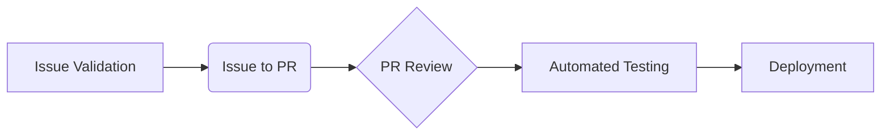

# Autonomous Dev Loop

## Development Flow

```mermaid
flowchart LR
    A[Issue Validation] --> B(Issue to PR)
    B --> C{PR Review}
    C --> D[Automated Testing]
    D --> E[Deployment]
```

> Diagram shows current validated flows: issue validation, issue-to-PR conversion, and PR review process.