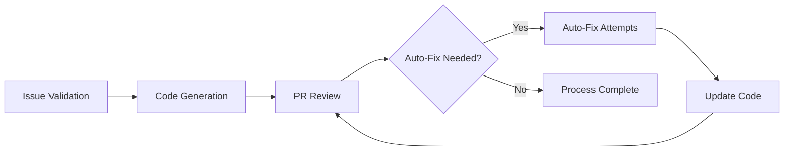

## Flow Diagram

```mermaid
graph LR
    A[Issue Validation] --> B[Code Generation]
    B --> C[PR Review]
    C --> D{Auto-Fix Needed?}
    D -->|Yes| E[Auto-Fix Attempts]
    E --> F[Update Code]
    F --> C
    D -->|No| G[Process Complete]
```

<!-- Existing README content preserved below -->
