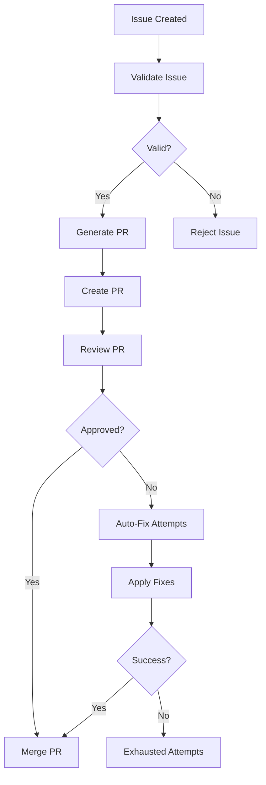

# Autonomous Dev Loop

## Flow Diagram

### Flow Details
1. **Issue Validation**: Automated validation of new issues
2. **Issue to PR**: Conversion of validated issues to pull requests
3. **PR Review**: Automated review process
4. **Auto-Fix Attempts**: Automated fixing of review issues