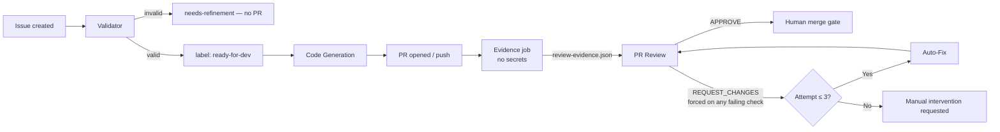

# autonomous-dev-loop

[](https://github.com/koydas/autonomous-dev-loop/actions/workflows/test.yml)
[](https://github.com/koydas/autonomous-dev-loop/actions/workflows/evals.yml)
[](https://koydas.github.io/autonomous-dev-loop/)
[](https://koydas.github.io/autonomous-dev-loop/)

**An AI dev loop that isn't allowed to wreck your repo.**

Label an issue → an LLM writes the PR → a second LLM reviews it against real test/lint results → an auto-fix agent addresses the findings → **you** merge. Runs entirely on GitHub Actions; Groq (`openai/gpt-oss-120b`) by default, Anthropic optional.

> Asked to fix one review finding, the auto-fix agent replaced a 690-line, 26-test suite with an 18-line stub that couldn't run ([ADR-0009](docs/adr/0009-llm-agent-guardrails.md)). Each boundary below links to the ADR recording the incident or exposure that forced it.

| | |
|---|---|
| **Dogfooded** | The loop wrote [13 merged PRs of its own](https://github.com/koydas/autonomous-dev-loop/pulls?q=is%3Apr+is%3Amerged+head%3Aai%2Fissue-) (11 features, 2 bug fixes — error taxonomy, bounded retry, checkpoint resume, provider fallback), each merged after human review. Then it was locked out of its own code: `scripts/`, `prompts/` and `config/` are now on the write denylist ([ADR-0021](docs/adr/0021-protected-write-path-denylist.md)). |
| **Tested** | 800+ tests on the built-in `node:test` runner, zero test dependencies, smoke tests wired to the real prompts and config |
| **Measured** | [Offline evals](#evals) run each LLM stage against a labelled dataset: verdict accuracy, per-class precision/recall/F1, error rate, consistency across repeats, latency, tokens — gated by thresholds, latest results on the [eval dashboard](https://koydas.github.io/autonomous-dev-loop/) ([ADR-0027](docs/adr/0027-offline-eval-harness.md)) |
| **Decided in writing** | [27 ADRs](docs/adr/README.md), each with context, rejected alternatives and trade-offs |

## Bounded autonomy, not "fully autonomous"

Prompts are advice; an LLM can ignore them. So the loop separates what it *asks* the model from what it *enforces* in code:

| Enforced in code / CI | Where |
|---|---|
| The review verdict is forced to `REQUEST_CHANGES` when any declared check (here: the test suite and a `node --check` syntax pass) fails on the PR head. A check that times out or crashes, or evidence that is missing or stale, **withholds** approval without triggering auto-fix ([ADR-0026](docs/adr/0026-withhold-approval-on-unverified-evidence.md)) | [ADR-0024](docs/adr/0024-tool-evidence-for-pr-review.md) |
| PR code runs in a job holding **no secrets** (`contents: read`, no persisted credentials, credential-like env vars stripped) | [ADR-0024](docs/adr/0024-tool-evidence-for-pr-review.md) |
| Pipeline scripts, prompts and config always run from the **default branch** — a PR cannot rewrite the code that reviews it | [ADR-0023](docs/adr/0023-trusted-pipeline-execution.md) |
| Write denylist: the model cannot touch `.github/`, `scripts/`, `prompts/`, `config/`, `docs/`, `README.md`, lockfiles, `.npmrc`, or escape via symlinks | [ADR-0021](docs/adr/0021-protected-write-path-denylist.md) |
| A change that cuts an existing file of 20+ lines to under half its lines or its non-whitespace content rejects the whole patch, before anything is written; both stages escalate the rejection to `needs-human` | [ADR-0021](docs/adr/0021-protected-write-path-denylist.md) (amendment), [ADR-0009](docs/adr/0009-llm-agent-guardrails.md) |
| Max 6 files per run, no absolute paths, no `..`, 16 000 chars per file | [ADR-0003](docs/adr/0003-safe-output-scope.md) |
| The AGENTS.md hard guardrails, on generation and auto-fix: never shrink a test file, never mix ESM/CJS, never change an exported signature (name, arity, parameters, sync/async) unless the issue or feedback names it, never add an import that does not resolve (builtin, existing relative path, `package.json`), never delete > 30% of a file, never rewrite a file the model was not shown in full. A violation rejects the whole patch before anything is written and escalates to `needs-human` with the rule | [ADR-0019](docs/adr/0019-static-verification-backstop.md), [ADR-0029](docs/adr/0029-autofix-deterministic-write-guard.md), [ADR-0009](docs/adr/0009-llm-agent-guardrails.md) |
| Max 3 auto-fix attempts, then escalation to a human; per-PR concurrency | [ADR-0006](docs/adr/0006-label-driven-auto-fix-trigger.md), [ADR-0020](docs/adr/0020-per-pr-workflow-concurrency.md) |
| Under-specified issues never reach generation (validation gate, `ready-for-dev` label) | [ADR-0001](docs/adr/0001-trigger-policy-and-label-gate.md) |
| Human merge — the loop never merges: no merge call exists in `scripts/` or the workflows | [`docs/mvp.md`](docs/mvp.md) (human review before merge), [`.github/workflows/`](.github/workflows/) |

| Asked of the model (prompt guardrails) | Where |
|---|---|
| Named defect checklist in review (read-only property writes, unauthorized imports, non-persistent refs), disclosure when the diff was truncated | [docs/code-generation.md](docs/code-generation.md#review-and-auto-fix-guardrails) |

The second table is what these static checks cannot catch. A type-check pass for read-only property writes is deferred in [ADR-0019](docs/adr/0019-static-verification-backstop.md#deferred-type-check-pass).

## How it works


```mermaid
graph LR
    A[Issue created] --> B[Validator]
    B -->|invalid| Z[needs-refinement — no PR]
    B -->|valid| C[label: ready-for-dev]
    C --> D[Code Generation]
    D --> E[PR opened / push]
    E --> EV[Evidence job<br/>no secrets]
    EV -->|review-evidence.json| F[PR Review]
    F -->|APPROVE| G[Human merge gate]
    F -->|REQUEST_CHANGES<br/>forced on any failing check| H{Attempt ≤ 3?}
    H -->|Yes| I[Auto-Fix]
    I --> F
    H -->|No| J[Manual intervention requested]
```

## Quick start

1. Add `GROQ_API_KEY` (or `ANTHROPIC_API_KEY`) in **Settings → Secrets and variables → Actions**. `AI_PR_TOKEN` is recommended for PR/label/review writes.
2. Open an issue. The validator scores it and applies `ready-for-dev` or `needs-refinement`; labels are created automatically.
3. Watch the PR appear, get reviewed, and get fixed. Merge it yourself.

Full setup, permissions, per-stage model keys and the end-to-end test: [docs/code-generation.md](docs/code-generation.md). Failure triage: [docs/runbook.md](docs/runbook.md).

### Code map

- Workflows: `.github/workflows/` (orchestration only)
- Entrypoints: `scripts/*.mjs`, modules: `scripts/lib/*.mjs`
- Prompts: `prompts/*.md` (one file per prompt, loaded at runtime)
- Evals: `scripts/run_evals.mjs`, suites in `scripts/lib/eval_suites.mjs`, datasets in `evals/datasets/`
- MVP definition: `docs/mvp.md`

## Iterative Review Loop

Once a PR is opened, the automation continues:

1. **PR Review** (`.github/workflows/pr-review.yml`) — triggered on every push to the PR branch. Posts or updates a review comment and submits an `APPROVE` or `REQUEST_CHANGES` verdict.
2. **Auto-Fix** (`.github/workflows/auto-fix-pr.yml`) — triggered when a review requests changes. Reads the review feedback, generates targeted fixes using the LLM, and pushes them back to the PR branch — re-triggering the review.

The loop runs up to **3 auto-fix iterations** per PR. After that, a comment is posted requesting manual intervention.

## Fail-Fast Startup & Payload Validation

Automation entrypoints now validate critical runtime inputs before network calls:
- required env vars are validated up-front with explicit errors,
- required prompt files are validated as existing and non-empty at load time,
- GitHub event payload fields are validated with explicit path-oriented messages (for example `pull_request.number`, `issue.number`, `pull_request.head.ref` / `ref`),
- provider response parsing errors include concrete JSON paths (`content[0].text`, `choices[0].message.content`).

## Observability

Every pipeline run produces two complementary outputs:

- **Structured JSON events** — one JSON line per event written to stderr by each script (`ts`, `run_id`, `stage`, `event`, `level`, `duration_ms`, `meta`). Error-level events also emit `::error::` GitHub Actions annotations.
- **Run trace file** — `observability/traces/<GITHUB_RUN_ID>.json`, written incrementally so it is always readable mid-run. Uploaded as the artifact `run-trace-<GITHUB_RUN_ID>` at the end of each workflow (`if: always()`).

Read a trace locally:

```bash
cat observability/traces/<run_id>.json | jq '[.spans[] | {stage, outcome, duration_ms}]'
```

All instrumentation goes through `scripts/lib/observability.mjs`. Schema reference and full event tables: `docs/observability.md`. Design rationale: [ADR-0018](docs/adr/0018-structured-observability.md).

## Evals

Tests mock the LLM to prove the wiring; evals call the real model on a fixed, labelled dataset to measure the quality of its decisions — so a prompt or model change can be compared on the same inputs before merge.

| Suite | Stage | Dataset | Gate (exit 1 below) |
|---|---|---|---|
| `validation` | Issue validation | [35 issues](evals/datasets/validation.jsonl) — 15 `core` (valid + each blocker B1–B4) and edge cases: partial AC, scope and B4 minimal pairs, short/French, warnings only, prompt injection | verdict accuracy ≥ 0.8 · `invalid` and `valid` recall ≥ 0.8 · consistency ≥ 0.9 (with `--repeats > 1`) · error rate ≤ 0.05 |
| `review` | PR review (prompt builder, verdict parser and evidence decision of `pr_review.mjs`) | [23 PR diffs](evals/datasets/review.jsonl) — real bugs (off-by-one, unhandled null, shell injection via `execSync`, deleted tests, undeclared import, …), buggy/clean minimal pairs, docs-only and test-only diffs, prompt injection, tool evidence (pass/fail/timeout), truncated diff | final verdict accuracy ≥ 0.75 · `request_changes` recall ≥ 0.8 · `approve` recall ≥ 0.6 · consistency ≥ 0.8 (with `--repeats > 1`) · error rate ≤ 0.05 |

```bash
npm run eval -- --suite validation --repeats 3     # live, needs GROQ_API_KEY or ANTHROPIC_API_KEY
npm run eval -- --suite validation --repeats 3 --scorecard   # + local dashboard preview in evals/site/
npm run eval -- --suite review --repeats 3         # ≈ 35–40 min on the Groq free tier (8K TPM)
npm run eval -- --suite validation --replay evals/results/validation-<runId>.json   # re-score, no LLM call
```

### Latest results

[](https://koydas.github.io/autonomous-dev-loop/)
[](https://koydas.github.io/autonomous-dev-loop/)

**[Eval dashboard →](https://koydas.github.io/autonomous-dev-loop/)** Per suite: the gate and its thresholds, the latest metrics with Δ against the previous run on the same dataset, a trend chart and the last 10 runs. Per run: the confusion matrix, per-class precision/recall/F1, and every case with its expected and predicted verdict, scores, latency and the raw model output. The badges above read the dashboard live.

Each run prints a Markdown report (metrics, threshold failures, failing cases), writes the full replayable results to `evals/results/`, and appends a summary to `evals/history.jsonl`. In CI: **Actions → [Evals](https://github.com/koydas/autonomous-dev-loop/actions/workflows/evals.yml) → Run workflow**, and every Monday for all suites — the report lands on the run's summary page, results in the artifacts, and a run on `main` is added to the [eval dashboard](https://koydas.github.io/autonomous-dev-loop/) (GitHub Pages), with nothing committed.

On a PR that touches a parser, `decideVerdict`, a scorer, a prompt or a dataset, the **Eval replay** workflow replays the last published live run of each suite against the PR's code (no LLM call, no secret), posts the Δ per metric and the cases that change verdict in the job summary, and fails when a threshold the published numbers meet breaks under the PR's thresholds. It does not measure a prompt change: the recorded responses stay the same. See [docs/evals.md](docs/evals.md#pr-replay-gate).

To measure a prompt change before merge, a maintainer adds the **`run-evals`** label to the PR: **PR evals** runs the suites of the changed prompts live, with the PR's `prompts/**` on top of `main`'s scripts and config, and comments the Δ against the last published run. A PR that also touches `scripts/` or `config/` is refused, nothing is published to the dashboard, and the label is removed after the run ([ADR-0030](docs/adr/0030-live-pr-prompt-evals.md), [docs/evals.md](docs/evals.md#live-pr-eval-run-evals-label)).

Adding a case, a scorer or a suite for another stage: [docs/evals.md](docs/evals.md). Design rationale: [ADR-0027](docs/adr/0027-offline-eval-harness.md).

## Tests

The test suite uses the built-in `node:test` runner — no external dependencies.

```bash
node --test scripts/tests/*.test.mjs
```

Two layers of tests:
- **Unit tests** — each module tested in isolation (`config`, `output_writer`, `issue_validator`, `observability`, etc.)
- **Smoke tests** (`smoke.test.mjs`) — full pipelines with real config files and prompt templates, LLM mocked at the network boundary

CI: `.github/workflows/test.yml` runs the full suite on every push and PR. Guide: `docs/testing.md`.
