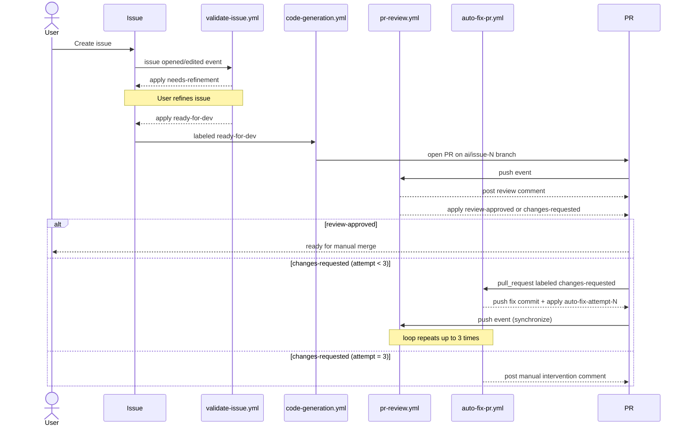

# Code Generation MVP Setup

This repository includes an MVP workflow that converts validated issues into AI-generated draft pull requests. The default AI provider is **Groq** (`qwen/qwen3-32b`). Anthropic (Claude models) is also supported and can be selected via the `AI_PROVIDER` environment variable when both provider keys are configured. The workflow triggers automatically when the validation agent applies the `ready-for-dev` label.

## Quick Start (Operator)

For a first-time setup, complete these steps in order:

1. Configure required secrets in **Settings → Secrets and variables → Actions**:
   - `ANTHROPIC_API_KEY` and/or `GROQ_API_KEY`
   - `AI_PR_TOKEN` (recommended for reliable PR/label/review writes)
2. (Optional) Configure provider variables:
   - `AI_PROVIDER`, `ANTHROPIC_MODEL`, `GROQ_MODEL`, `GROQ_API_URL`
3. Confirm repository Actions permission strategy:
   - either enable **Allow GitHub Actions to create and approve pull requests**
   - or keep it disabled and rely on `AI_PR_TOKEN`
4. Create/edit an issue and wait for `ready-for-dev`.
5. Verify generated PR appears on branch `ai/issue-<number>`.
6. Monitor review loop labels:
   - `review-approved` ends the loop
   - `changes-requested` triggers auto-fix (up to 3 attempts)

If something fails, use `docs/runbook.md` symptom mapping and recovery actions first.

## Workflow Overview

File: `.github/workflows/code-generation.yml`

Workflow design note: YAML stays intentionally minimal (orchestration only). Most logic lives in Node modules for future unit testing.

Node implementation:
- Entrypoint: `scripts/generate_issue_change.mjs`
- Modules: `scripts/lib/config.mjs`, `scripts/lib/llm_client.mjs`, `scripts/lib/anthropic_client.mjs`, `scripts/lib/groq_client.mjs`, `scripts/lib/output_writer.mjs`

When the `ready-for-dev` label is applied to an issue, the workflow:
1. Builds a deterministic prompt using issue number, title, and body.
2. Calls the LLM API (Groq by default) using repository secrets.
3. Writes 1 to 6 generated files at AI-selected relative paths.
4. Creates a branch named `ai/issue-<number>`.
5. Uses `peter-evans/create-pull-request` to commit generated content on `ai/issue-<number>`.
6. Opens a PR to the repository default branch with `Closes #<issue_number>`.

If generation fails or no patch is produced, the workflow exits before PR creation.

## Required Secrets

Configure these in **Settings → Secrets and variables → Actions**:

Provider selection is automatic based on which secrets are configured:

| Secrets configured | Provider used |
|---|---|
| `GROQ_API_KEY` only | Groq |
| `ANTHROPIC_API_KEY` only | Anthropic |
| Both | Groq (default) — override with `AI_PROVIDER=anthropic` |
| Neither | Fails with a clear error |

- **Secret**: `ANTHROPIC_API_KEY` — API key for Anthropic (Claude models).
- **Secret**: `GROQ_API_KEY` — API key for Groq.
- **Secret**: `AI_PR_TOKEN` (recommended) — GitHub token used for PR creation.
  - Use a fine-grained PAT or GitHub App token with at least **Contents: Read/Write**, **Pull requests: Read/Write**, and **Issues: Read/Write** on this repository.
  - If `AI_PR_TOKEN` is not set, the workflow falls back to `GITHUB_TOKEN`.
- **Variables** (optional):
  - `AI_PROVIDER` — `anthropic` or `groq`. Only needed when both keys are configured; Groq is the default.
  - `ANTHROPIC_MODEL` — Anthropic model name (defaults to `claude-opus-4-7` if unset).
  - `GROQ_MODEL` — Groq model name (defaults to `qwen/qwen3-32b` if unset).
  - `GROQ_API_URL` — Groq endpoint URL (defaults to `https://api.groq.com/openai/v1/chat/completions` if unset).

### Per-workflow environment variable matrix

All four workflows pass both provider key sets, so provider selection is driven entirely by which secrets are configured in the repository — no workflow-level override is needed.

| Workflow | Required secret(s) | Optional variables | Fallback |
|---|---|---|---|
| `validate-issue.yml` | `ANTHROPIC_API_KEY` or `GROQ_API_KEY` | `AI_PROVIDER`, `ANTHROPIC_MODEL`, `GROQ_MODEL`, `GROQ_API_URL` | Fails with clear error if neither key is present |
| `code-generation.yml` | `ANTHROPIC_API_KEY` or `GROQ_API_KEY` | `AI_PROVIDER`, `ANTHROPIC_MODEL`, `GROQ_MODEL`, `GROQ_API_URL` | Fails with clear error if neither key is present |
| `pr-review.yml` | `ANTHROPIC_API_KEY` or `GROQ_API_KEY` | `AI_PROVIDER`, `ANTHROPIC_MODEL`, `GROQ_MODEL`, `GROQ_API_URL` | Fails with clear error if neither key is present |
| `auto-fix-pr.yml` | `ANTHROPIC_API_KEY` or `GROQ_API_KEY` | `AI_PROVIDER`, `ANTHROPIC_MODEL`, `GROQ_MODEL`, `GROQ_API_URL` | Fails with clear error if neither key is present |

`AI_PR_TOKEN` is used only by `code-generation.yml`, `pr-review.yml`, and `auto-fix-pr.yml` for GitHub API write operations.

## GitHub Actions PR Permission Requirement

If the run fails with:

`GitHub Actions is not permitted to create or approve pull requests.`

you have two supported options:

1. Enable repository setting **Settings → Actions → General → Workflow permissions → Allow GitHub Actions to create and approve pull requests**.
2. Set `AI_PR_TOKEN` and keep the setting disabled (recommended for stricter org policies).

## Required Label

The validation workflow creates and manages these labels automatically:

- `ready-for-dev` — applied when issue quality is sufficient; triggers PR generation.
- `needs-refinement` — applied when the issue requires clearer acceptance criteria.

The PR review workflow creates and manages these labels automatically:

- `review-approved` — applied when the automated code review verdict is APPROVED.
- `changes-requested` — applied when the automated code review verdict is REQUEST_CHANGES.

All label names, colors, and descriptions are configurable in `config/labels.yaml`.

## End-to-End Test

1. Ensure secrets above are configured.
2. Create a new GitHub issue using the feature or bug template, with a clear title and body.
3. Open **Actions** and confirm run `Issue Validation Agent` starts.
4. Once validation passes, confirm `Code Generation` starts automatically from the `ready-for-dev` label event.
5. Verify logs for:
   - prompt construction
   - LLM API call success
   - branch creation (`ai/issue-<number>`)
   - PR creation
6. Confirm PR details:
   - title references the issue number/title
   - body includes generated summary and `Closes #<number>`
   - changed files are limited to the generated AI target paths (maximum 6 files)

## Loop: `issue -> issue review`

The project now runs as a continuous loop rather than a one-shot generation:

1. **Issue validation** (`validate-issue.yml`) reviews issue quality and applies `ready-for-dev` or `needs-refinement`.
2. **Code generation** (`code-generation.yml`) starts only when `ready-for-dev` is applied and opens/updates a PR for that issue.
3. **PR review** (`pr-review.yml`) runs on branch pushes, posts structured feedback, submits review status, and applies `review-approved` or `changes-requested`.
4. **Auto-fix** (`auto-fix-pr.yml`) runs when `changes-requested` is applied, or when a PR comment contains `- [x] Relancer Auto Fixer`, then generates a targeted fix commit and pushes it.
5. The push from auto-fix re-triggers **PR review**, creating the iterative review loop.
6. The loop ends when either:
   - PR review returns `review-approved`, or
   - auto-fix reaches 3 attempts and requests manual intervention.

In practice, this means the issue is not only used to create the initial PR; it also drives the downstream review/fix cycles through labels and automated review signals.

## End-to-End Control Flow

## Limitations (MVP)

- Triggers on `ready-for-dev` label application event.
- Applies 1 to 6 generated files per run (safe scope).
- Does not perform auto-merge.
- Does not attempt multi-file or complex refactors.

## Risk and Mitigation Note

- **Risk:** AI output may be low quality or off-target.
  - **Mitigation:** deterministic prompt template, temperature `0` for generation and validation (see `config/models.yaml`), and small-scope generated file.
- **Risk:** accidental broad modifications.
  - **Mitigation:** generated patch is constrained to validated relative paths with a hard limit of 6 files per run.
- **Risk:** workflow secrets misconfiguration.
  - **Mitigation:** explicit secret checks and fail-fast logging before commit/PR steps.

## PR Review Workflow

File: `.github/workflows/pr-review.yml`

Required secret:
- **Secret**: `ANTHROPIC_API_KEY` or `GROQ_API_KEY` — used to review pull request diffs. Same provider selection rules apply (see above).
- **Secret**: `AI_PR_TOKEN` (recommended) — used for PR review writes (comments/review events/labels) so downstream label-based workflows (like auto-fix) can be triggered reliably. Falls back to `GITHUB_TOKEN` when unset.

The workflow runs on every `push` to any branch (`branches: ["**"]`) with permissions `pull-requests: write`, `contents: read`, `issues: write`, and `actions: read`. On push events the script resolves the PR number via the GitHub API; if no open PR exists for the branch it exits silently.

On each run it:
1. Fetches the PR title, body, and diff; calls the LLM for a structured review.

For automation-scope PRs (changes in `.github/workflows/`, `scripts/`, `prompts/`, or `docs/code-generation.md`), the review prompt now enforces three mandatory checks:
- unit-test status is explicitly reviewed,
- documentation updates are required when behavior/config/setup changes,
- minimum unit-test coverage expectations must remain explicit and enforced/documented.

Minimum expectation for automation-scope changes: add or update at least one targeted unit test for each new behavior branch (happy path + one guard/negative path), and run `node --test scripts/tests/*.test.mjs` in the same PR.

If these gates are missing, the automated review returns `REQUEST_CHANGES` with actionable findings.
2. Posts or updates a single comment on the PR with the full review text (existing review comments are updated in place).
3. Submits an official GitHub pull request review event (`APPROVE` or `REQUEST_CHANGES`) with a short redirect body. The full review detail lives only in the comment, preventing duplicate content from appearing in the PR conversation.
4. Applies the label `review-approved` or `changes-requested` to the PR (and removes the other). When verdict is `REQUEST_CHANGES`, it removes and re-applies `changes-requested` so each review iteration emits a fresh `labeled` event — unless an auto-fix run is already `queued`/`in_progress`, or run-status checks fail (fail-closed guard), in which case re-pulse is skipped to avoid loop amplification.

**Review submission permission:** submitting a GitHub review requires the repository setting **Settings → Actions → General → Allow GitHub Actions to create and approve pull requests** to be enabled. If it is not enabled, the review submission is skipped with a warning (the comment and labels are still applied). This is the same setting used for PR creation by the generation workflow.

## Auto-Fix Workflow

File: `.github/workflows/auto-fix-pr.yml`

Node implementation:
- Entrypoint: `scripts/auto_fix_pr.mjs`
- Prompts: `prompts/auto-fix-system.md`, `prompts/auto-fix-user.md`

Required secret:
- **Secret**: `GROQ_API_KEY` (or `ANTHROPIC_API_KEY`) — same provider selection rules apply (see above).

The workflow triggers on either `pull_request` `labeled` events (matching `review.changes.name` from `config/labels.yaml`, default `changes-requested`) or `issue_comment` `created/edited` events when the comment body contains `- [x] Relancer Auto Fixer`.

This avoids silent skips when GitHub Actions cannot submit an official `REQUEST_CHANGES` review event (for example when repository settings block review submission), because the PR review workflow still applies the `changes-requested` label.

On each run it:
1. Checks the PR for `auto-fix-attempt-N` labels to determine how many auto-fix cycles have already run. For checkbox-triggered reruns, it first removes existing `auto-fix-attempt-N` labels and deletes local `checkpoint-attempt-*.json` files before continuing.
2. If the attempt count has reached the maximum (3), posts a comment explaining that the limit is exhausted and exits without making changes.
3. Fetches the review body and any inline review comments to build the full feedback context. If the triggering event has no review body (for example label-based trigger), it paginates issue comments and falls back to the latest automated review comment body.
4. Fetches the current PR diff and reads the changed files from disk (up to 10 files, capped at 8 000 chars each).
5. Calls the LLM with the review feedback, diff, and current file contents to generate targeted fixes.
6. Writes 1 to 6 fixed files to the PR branch, commits, and pushes.
7. Applies the `auto-fix-attempt-N` label to the PR for tracking.
8. The push triggers a new `synchronize` event on the PR, which re-runs the PR Review workflow — closing the iterative loop.

**Iteration limit:** the loop runs at most 3 times per PR. After 3 auto-fix attempts, the workflow posts a comment asking for manual intervention.

**Required label:**

The auto-fix workflow creates and manages these labels automatically:

- `auto-fix-attempt-1`, `auto-fix-attempt-2`, `auto-fix-attempt-3` — each applied after the corresponding fix cycle completes.

All label names, colors, and descriptions are configurable in `config/labels.yaml` under the `autofix` key.
