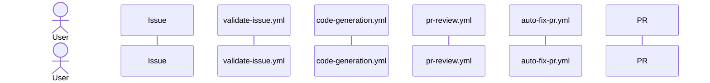

# Code Generation MVP Setup

This repository includes an MVP workflow that converts validated issues into AI-generated draft pull requests. The default AI provider is **Groq** with stage-specific defaults: `validation`/`review` use `qwen/qwen3-32b`, while `generation`/`autofix` use `llama-3.3-70b-versatile`. Anthropic (Claude models) is also supported and can be selected via the `AI_PROVIDER` environment variable when both provider keys are configured. The workflow triggers automatically when the validation agent applies the `ready-for-dev` label.

## Quick Start (Operator)

For a first-time setup, complete these steps in order:

1. Configure required secrets in **Settings → Secrets and variables → Actions**:
   - `ANTHROPIC_API_KEY` and/or `GROQ_API_KEY`
   - `AI_PR_TOKEN` (recommended for reliable PR/label/review writes)
2. (Optional) Configure provider variables:
   - `AI_PROVIDER` — `anthropic` or `groq`. Only needed when both keys are configured; Groq is the default.
   - `ANTHROPIC_MODEL` — Anthropic model name (defaults to `claude-opus-4-7` if unset).
   - `GROQ_MODEL` — Groq model name override for all stages (if unset, stage defaults from `config/models.yaml` are used: `generation`/`autofix` = `llama-3.3-70b-versatile`, `validation`/`review` = `qwen/qwen3-32b`).
   - `GROQ_API_URL` — Groq endpoint URL (defaults to `https://api.groq.com/openai/v1/chat/completions` if unset).

### Per-workflow environment variable matrix

All four workflows pass both provider key sets, so provider selection is driven entirely by which secrets are configured in the repository — no workflow-level override is needed.

| Workflow | Required secret(s) | Optional variables | Fallback |
|---|---|---|---|
| `validate-issue.yml` | `ANTHROPIC_API_KEY` or `GROQ_API_KEY` | `AI_PROVIDER`, `ANTHROPIC_MODEL`, `GROQ_MODEL`, `GROQ_API_URL` | Fails with clear error if neither key is present |
| `code-generation.yml` | `ANTHROPIC_API_KEY` or `GROQ_API_KEY` | `AI_PROVIDER`, `ANTHROPIC_MODEL`, `GROQ_MODEL`, `GROQ_API_URL` | Fails with clear error if neither key is present |
| `pr-review.yml` | `ANTHROPIC_API_KEY` or `GROQ_API_KEY` | `AI_PROVIDER`, `ANTHROPIC_MODEL`, `GROQ_MODEL`, `GROQ_API_URL` | Fails with clear error if neither key is present |
| `auto-fix-pr.yml` | `ANTHROPIC_API_KEY` or `GROQ_API_KEY` | `AI_PROVIDER`, `ANTHROPIC_MODEL`, `GROQ_MODEL`, `GROQ_API_URL` | Fails with clear error if neither key is present |

`AI_PR_TOKEN` is used only by `code-generation.yml`, `pr-review.yml`, and `auto-fix-pr.yml` for GitHub API write operations.

## GitHub Actions PR Permission Requirement

If the run fails with:

`GitHub Actions is not permitted to create or approve pull requests.`

you have two supported options:

1. Enable repository setting **Settings → Actions → General → Workflow permissions → Allow GitHub Actions to create and approve pull requests**.
2. Set `AI_PR_TOKEN` and keep the setting disabled (recommended for stricter org policies).

## Required Label

The validation workflow creates and manages these labels automatically:

- `ready-for-dev` — applied when issue quality is sufficient; triggers PR generation.
- `needs-refinement` — applied when the issue requires clearer acceptance criteria.

The PR review workflow creates and manages these labels automatically:

- `review-approved` — applied when the automated code review verdict is APPROVED.
- `changes-requested` — applied when the automated code review verdict is REQUEST_CHANGES.

All label names, colors, and descriptions are configurable in `config/labels.yaml`.

## End-to-End Test

1. Ensure secrets above are configured.
2. Create a new GitHub issue using the feature or bug template, with a clear title and body.
3. Open **Actions** and confirm run `Issue Validation Agent` starts.
4. Once validation passes, confirm `Code Generation` starts automatically from the `ready-for-dev` label event.
5. Verify logs for:
   - prompt construction
   - LLM API call success
   - branch creation (`ai/issue-<number>`)
   - PR creation
6. Confirm PR details:
   - title references the issue number/title
   - body includes generated summary and `Closes #<number>`
   - changed files are limited to the generated AI target paths (maximum 6 files)

## Loop: `issue -> issue review`

The project now runs as a continuous loop rather than a one-shot generation:

1. **Issue validation** (`validate-issue.yml`) reviews issue quality and applies `ready-for-dev` or `needs-refinement`.
2. **Code generation** (`code-generation.yml`) starts only when `ready-for-dev` is applied and opens/updates a PR for that issue.
3. **PR review** (`pr-review.yml`) runs on branch pushes, posts structured feedback, submits review status, and applies `review-approved` or `changes-requested`.
4. **Auto-fix** (`auto-fix-pr.yml`) runs when `changes-requested` is applied, generates a targeted fix commit, and pushes it.
5. The push from auto-fix re-triggers **PR review**, creating the iterative review loop.
6. The loop ends when either:
   - PR review returns `review-approved`, or
   - auto-fix reaches 3 attempts and requests manual intervention.

## End-to-End Control Flow



## Structured Logging API (`scripts/lib/logger.mjs`)

All automation scripts share a structured JSON logger. Each line written to stdout/stderr is a valid JSON object.

### Core functions

```js
import { log, error, setLogContext, logStart, logEnd, logSummary } from './lib/logger.mjs';
```

| Function | Output stream | `level` field | Description |
|---|---|---|---|
| `log(msg, data?)` | stdout | `info` | General informational event |
| `error(msg, data?)` | stderr | `error` | Error or warning event |
| `logSummary({ success, stepsCompleted, errors })` | stdout | `info` | Emits a `run_summary` entry at script exit |
| `logStart(step)` | — | — | Records start timestamp for a named step |
| `logEnd(step, result)` | stdout | `info` | Emits `step_end` with elapsed `durationMs` |

### Log context

Call `setLogContext(fields)` once at startup to attach fields (e.g. `run_id`, `step`, `attempt`) to every subsequent `log` and `error` call. Per-call `data` fields override context fields with the same key.

```js
setLogContext({ run_id: process.env.GITHUB_RUN_ID, step: 'auto-fix', attempt: 1 });
log('Starting', { prNumber: 42 });
// → {"level":"info","msg":"Starting","run_id":"…","step":"auto-fix","attempt":1,"prNumber":42}
```

### Run summary

Emit a terminal summary in the `unhandledRejection` handler and at normal exit so log consumers can detect silent failures:

```js
// on failure
logSummary({ success: false, stepsCompleted: ['labels'], errors: [err.message] });

// on success
logSummary({ success: true, stepsCompleted: ['labels', 'diff', 'llm', 'write', 'label'], errors: [] });
```

### Step timing

```js
logStart('llm-call');
const raw = await callLLM(…);
logEnd('llm-call', 'ok');
// → {"level":"info","msg":"step_end","step":"llm-call","result":"ok","durationMs":1234.5}
```

## Minimum Test Coverage Policy

The config validation logic must have a minimum test coverage of 80%. This ensures that all critical paths are properly tested and validated before deployment.

## Startup Fail-Fast Validation (automation entrypoints)

Automation scripts must fail before network calls when required startup inputs are invalid:

- **Environment**: required vars are validated synchronously at process start (`GITHUB_TOKEN`, `GITHUB_REPOSITORY`, `GITHUB_EVENT_PATH`, provider API key, etc.).
- **Prompts**: prompt files are loaded and validated as existing + non-empty at startup, with explicit file-path errors when missing/empty.
- **GitHub payload**: required fields are validated with path-based errors:
  - PR number: `pull_request.number` or fallback `issue.number`.
  - Branch reference (when needed): `pull_request.head.ref` or fallback `ref`.
- **Provider payload parsing**: response-shape failures include concrete expected paths:
  - Anthropic: `content[0].text`
  - Groq: `choices[0].message.content`
