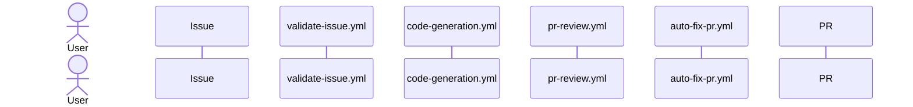

# Code Generation MVP Setup

This repository includes an MVP workflow that converts validated issues into AI-generated draft pull requests. The default AI provider is **Groq** with stage-specific defaults: `validation`/`review` use `qwen/qwen3-32b`, while `generation`/`autofix` use `llama-3.3-70b-versatile`. Anthropic (Claude models) is also supported and can be selected via the `AI_PROVIDER` environment variable when both provider keys are configured. The workflow triggers automatically when the validation agent applies the `ready-for-dev` label.

## Quick Start (Operator)

For a first-time setup, complete these steps in order:

1. Configure required secrets in **Settings → Secrets and variables → Actions**:
   - `ANTHROPIC_API_KEY` and/or `GROQ_API_KEY`
   - `AI_PR_TOKEN` (recommended for reliable PR/label/review writes)
2. (Optional) Configure provider variables:
   - `AI_PROVIDER` — `anthropic` or `groq`. Only needed when both keys are configured; Groq is the default.
   - `ANTHROPIC_MODEL` — Anthropic model name (defaults to `claude-opus-4-7` if unset).
   - `GROQ_MODEL` — Groq model name override for all stages (if unset, stage defaults from `config/models.yaml` are used: `generation`/`autofix` = `llama-3.3-70b-versatile`, `validation`/`review` = `qwen/qwen3-32b`).
   - `GROQ_API_URL` — Groq endpoint URL (defaults to `https://api.groq.com/openai/v1/chat/completions` if unset).

### Per-workflow environment variable matrix

All four workflows pass both provider key sets, so provider selection is driven entirely by which secrets are configured in the repository — no workflow-level override is needed.

| Workflow | Required secret(s) | Optional variables | Fallback |
|---|---|---|---|
| `validate-issue.yml` | `ANTHROPIC_API_KEY` or `GROQ_API_KEY` | `AI_PROVIDER`, `ANTHROPIC_MODEL`, `GROQ_MODEL`, `GROQ_API_URL` | Fails with clear error if neither key is present |
| `code-generation.yml` | `ANTHROPIC_API_KEY` or `GROQ_API_KEY` | `AI_PROVIDER`, `ANTHROPIC_MODEL`, `GROQ_MODEL`, `GROQ_API_URL` | Fails with clear error if neither key is present |
| `pr-review.yml` | `ANTHROPIC_API_KEY` or `GROQ_API_KEY` | `AI_PROVIDER`, `ANTHROPIC_MODEL`, `GROQ_MODEL`, `GROQ_API_URL` | Fails with clear error if neither key is present |
| `auto-fix-pr.yml` | `ANTHROPIC_API_KEY` or `GROQ_API_KEY` | `AI_PROVIDER`, `ANTHROPIC_MODEL`, `GROQ_MODEL`, `GROQ_API_URL` | Fails with clear error if neither key is present |
| `changelog-check.yml` | _(none)_ | `BASE_REF` (set automatically from `github.base_ref`) | Fails if an entrypoint or ADR file is changed without a bullet entry under `## [Unreleased]` in `CHANGELOG.md` |

`AI_PR_TOKEN` is used only by `code-generation.yml`, `pr-review.yml`, and `auto-fix-pr.yml` for GitHub API write operations.

## GitHub Actions PR Permission Requirement

If the run fails with:

`GitHub Actions is not permitted to create or approve pull requests.`

you have two supported options:

1. Enable repository setting **Settings → Actions → General → Workflow permissions → Allow GitHub Actions to create and approve pull requests**.
2. Set `AI_PR_TOKEN` and keep the setting disabled (recommended for stricter org policies).

## Required Label

The validation workflow creates and manages these labels automatically:

- `ready-for-dev` — applied when issue quality is sufficient; triggers PR generation.
- `needs-refinement` — applied when the issue requires clearer acceptance criteria.

The PR review workflow creates and manages these labels automatically:

- `review-approved` — applied when the automated code review verdict is APPROVED.
- `changes-requested` — applied when the automated code review verdict is REQUEST_CHANGES.

All label names, colors, and descriptions are configurable in `config/labels.yaml`.

## End-to-End Test

1. Ensure secrets above are configured.
2. Create a new GitHub issue using the feature or bug template, with a clear title and body.
3. Open **Actions** and confirm run `Issue Validation Agent` starts.
4. Once validation passes, confirm `Code Generation` starts automatically from the `ready-for-dev` label event.
5. Verify logs for:
   - prompt construction
   - LLM API call success
   - branch creation (`ai/issue-<number>`)
   - PR creation
6. Confirm PR details:
   - title references the issue number/title
   - body includes generated summary and `Closes #<number>`
   - changed files are limited to the generated AI target paths (maximum 6 files)

## Loop: `issue -> issue review`

The project now runs as a continuous loop rather than a one-shot generation:

1. **Issue validation** (`validate-issue.yml`) reviews issue quality and applies `ready-for-dev` or `needs-refinement`.
2. **Code generation** (`code-generation.yml`) starts only when `ready-for-dev` is applied and opens/updates a PR for that issue.
3. **PR review** (`pr-review.yml`) runs on branch pushes, posts structured feedback, submits review status, and applies `review-approved` or `changes-requested`.
4. **Auto-fix** (`auto-fix-pr.yml`) runs when `changes-requested` is applied, generates a targeted fix commit, and pushes it.
5. The push from auto-fix re-triggers **PR review**, creating the iterative review loop.
6. The loop ends when either:
   - PR review returns `review-approved`, or
   - auto-fix reaches 3 attempts and requests manual intervention.

## End-to-End Control Flow


```mermaid
sequenceDiagram
    actor User
    participant Issue
    participant validate-issue.yml
    participant code-generation.yml
    participant pr-review.yml
    participant auto-fix-pr.yml
    participant PR


```

## Structured Logging API (`scripts/lib/logger.mjs`)

All automation scripts share a structured JSON logger. Each line written to stdout/stderr is a valid JSON object.

### Core functions

```js
import { log, error, setLogContext, logStart, logEnd, logSummary } from './lib/logger.mjs';
```

| Function | Output stream | `level` field | Description |
|---|---|---|---|
| `log(msg, data?)` | stdout | `info` | General informational event |
| `error(msg, data?)` | stderr | `error` | Error or warning event |
| `logSummary({ success, stepsCompleted, errors })` | stdout | `info` | Emits a `run_summary` entry at script exit |
| `logStart(step)` | — | — | Records start timestamp for a named step |
| `logEnd(step, result)` | stdout | `info` | Emits `step_end` with elapsed `durationMs` |

### Log context

Call `setLogContext(fields)` once at startup to attach fields (e.g. `run_id`, `step`, `attempt`) to every subsequent `log` and `error` call. Per-call `data` fields override context fields with the same key.

```js
setLogContext({ run_id: process.env.GITHUB_RUN_ID, step: 'auto-fix', attempt: 1 });
log('Starting', { prNumber: 42 });
// → {"level":"info","msg":"Starting","run_id":"…","step":"auto-fix","attempt":1,"prNumber":42}
```

### Run summary

Emit a terminal summary in the `unhandledRejection` handler and at normal exit so log consumers can detect silent failures:

```js
// on failure
logSummary({ success: false, stepsCompleted: ['labels'], errors: [err.message] });

// on success
logSummary({ success: true, stepsCompleted: ['labels', 'diff', 'llm', 'write', 'label'], errors: [] });
```

### Step timing

```js
logStart('llm-call');
const raw = await callLLM(…);
logEnd('llm-call', 'ok');
// → {"level":"info","msg":"step_end","step":"llm-call","result":"ok","durationMs":1234.5}
```

## Prompt Caching

`callAnthropic` in `scripts/lib/anthropic_client.mjs` passes the system prompt as a single-element array with `cache_control: { type: "ephemeral" }`, enabling Anthropic's prompt caching:

```json
{
  "system": [
    {
      "type": "text",
      "text": "<system prompt>",
      "cache_control": { "type": "ephemeral" }
    }
  ]
}
```

No beta header is required — this is a GA feature. Prompts shorter than the model's minimum cacheable prefix are silently not cached without error. The threshold is **2 048 tokens** for Haiku 4.5 and Sonnet 4.6, and **4 096 tokens** for Opus 4.7. The `validation-system` prompt is ~8 600 characters (~2 100 tokens), which clears the Haiku/Sonnet threshold but not the Opus 4.7 threshold — cache hits will not occur with the default `claude-opus-4-7` model unless the prompt is extended past ~16 000 characters. Cache reads cost ~10% of the normal input token price; cache writes cost ~1.25×.

## Minimum Test Coverage Policy

The following modules must maintain **≥ 80% test coverage** across statements, branches, functions, and lines, enforced in CI by `test.yml` via `c8 --check-coverage`:

- **Checkpoint resume** (`scripts/lib/checkpoint.mjs`): every distinct failure branch (ENOENT vs non-ENOENT in `readCheckpoint`, `mkdir` propagation in `writeCheckpoint`) must have a dedicated test case.
- **Configuration** (`scripts/lib/config.mjs`): provider detection, environment variable loading, and LLM config construction paths.
- **LLM client** (`scripts/lib/llm_client.mjs`): provider routing, fallback on transient errors, and permanent-error short-circuit.
- **Output writer** (`scripts/lib/output_writer.mjs`): JSON parsing (fence-first strategy, case-insensitive fence detection, `JsonParseError` typed errors with full tier diagnostics), validation error branches, and file write paths.

## PR Review: Context-Aware Change Classification

Before generating review findings, `scripts/pr_review.mjs` injects two context blocks into the LLM prompt:

1. **Change classification** (`scripts/lib/change_classifier.mjs`) — inspects changed file paths from the diff and emits a structured block with:
   - `change_type` — dominant category (`documentation`, `ci_cd`, `configuration`, `dependency_update`, `test_only`, `feature_or_bugfix`, `mixed`)
   - `detected_categories` — all matched categories
   - `has_executable_code_changes` — true when any file falls outside the non-behavioral set
   - `tests_expected` / `tests_expected_reason` — whether test coverage findings should be generated

2. **Automation gate context** (`scripts/lib/coverage_checker.mjs`) — existing gate that checks whether automation-scope changes (scripts/, prompts/, .github/workflows/, docs/code-generation.md) include test and doc updates.

### Classification rules

| File pattern | Category | `tests_expected` |
|---|---|---|
| `.md` files outside automation scope (`docs/adr/`, `README.md`, etc.) | `documentation` | false |
| `.github/workflows/*.yml` (automation scope) | `ci_cd` | **true** |
| `config/`, `tsconfig*.json`, `.eslintrc*`, etc. | `configuration` | false |
| `package-lock.json`, `yarn.lock`, `pnpm-lock.yaml` | `dependency_update` | false |
| `package.json` | _(executable code)_ | **true** |
| `scripts/tests/*.test.mjs`, `*.spec.*` | `test_only` | false |
| All other files (scripts/, prompts/, etc.) | _(executable code)_ | **true** |

When `tests_expected` is false the LLM is instructed to omit all test-coverage findings and not lower its verdict score because of absent tests.

`package.json` is treated as executable code (not `dependency_update`) because it owns behavioural fields (`type`, `scripts`, `engines`). Only auto-generated lock files are classified as pure dependency updates.

## Changelog Gate (`changelog-check.yml`)

Runs on every pull request. Calls `node scripts/check_changelog.mjs` to verify that:

1. If the PR touches any **entrypoint script** (`scripts/*.mjs`, top-level only) or any **ADR file** (`docs/adr/NNNN-*.md`), then `CHANGELOG.md` must also be modified.
2. The modification must include at least one added bullet line (starting with `- ` or `* `) inside the `## [Unreleased]` section. Adding only a section heading like `### Added` is not sufficient.

The check is skipped automatically if neither entrypoints nor ADRs are in the diff. No secrets or LLM calls are required.

**Adding a changelog entry** (see `CONTRIBUTING.md § Changelog Policy`):
```markdown
## [Unreleased]

### Added | Changed | Fixed | Removed
- Brief description of the change (ADR-XXXX or PR #NNN)
```

## Checkpoint Resume

Critical job outputs are persisted to `./checkpoints/<runId>/<step>.json` via `scripts/lib/checkpoint.mjs` and exchanged between jobs as GitHub Actions artifacts. This allows a re-triggered run to resume from the last successful step rather than starting from scratch.

### RunId naming conventions

| Workflow chain | RunId format | Artifact name |
|---|---|---|
| `validate-issue` → `code-generation` | `issue-<number>` | `checkpoints-issue-<number>` |
| `pr-review` → `auto-fix-pr` | `pr-<number>` | `checkpoints-pr-<number>` |

The `CHECKPOINT_RUN_ID` environment variable overrides the default; each script falls back to deriving the ID from `ISSUE_NUMBER` or the resolved PR number if the variable is absent.

### Step names written per job

| Job script | Step name | Persisted fields |
|---|---|---|
| `validate_issue.mjs` | `validate` | `valid`, `score` |
| `generate_issue_change.mjs` | `generate` | `summary`, `outputPaths` |
| `pr_review.mjs` | `review` | `isApproved`, `prNumber` |
| `auto_fix_pr.mjs` | `autofix` | `prNumber`, `attempt`, `outputPaths` |

### Prerequisite enforcement

`code-generation` (when triggered by the automated pipeline via `validate_run_id` dispatch input) and `auto-fix-pr` both fail explicitly with `::error::` if the expected upstream checkpoint file is not present, preventing execution in an incoherent state.

### Cross-workflow artifact download

- `validate-issue` passes its `GITHUB_RUN_ID` as the `validate_run_id` workflow-dispatch input when triggering `code-generation`. The generate job uses this run-id to download the artifact.
- `auto-fix-pr` queries the GitHub Actions artifacts API (`GET /repos/{owner}/{repo}/actions/artifacts?name=checkpoints-pr-{N}`) to find the most recent non-expired artifact by name, then downloads it via `curl`. This avoids a race condition where the triggering `pr-review.yml` run may not yet be listed as `completed` by `gh run list` at the moment the auto-fix job begins.

### Artifact retention

GitHub Actions artifact retention applies (default 90 days). Old checkpoint artifacts for the same issue or PR number are overwritten (`overwrite: true`) on each new run.

### Test coverage requirement

`scripts/lib/checkpoint.mjs` and all code paths that call `writeCheckpoint`/`readCheckpoint` must maintain **≥ 80% test coverage**. Every distinct failure branch (e.g. ENOENT vs non-ENOENT in `readCheckpoint`, `mkdir` propagation in `writeCheckpoint`) must have a dedicated test case.

## Startup Fail-Fast Validation (automation entrypoints)

Automation scripts must fail before network calls when required startup inputs are invalid:

- **Environment**: required vars are validated synchronously at process start (`GITHUB_TOKEN`, `GITHUB_REPOSITORY`, `GITHUB_EVENT_PATH`, provider API key, etc.).
- **Prompts**: prompt files are loaded and validated as existing + non-empty at startup, with explicit file-path errors when missing/empty.
- **GitHub payload**: required fields are validated with path-based errors:
  - PR number: `pull_request.number` or fallback `issue.number`.
  - Branch reference (when needed): `pull_request.head.ref` or fallback `ref`.
- **Provider payload parsing**: response-shape failures include concrete expected paths:
  - Anthropic: `content[0].text`
  - Groq: `choices[0].message.content`

## CI Coverage Enforcement

The repository enforces a minimum test coverage policy through CI using `c8 --check-coverage`. Each of the following modules must maintain **≥ 80% test coverage** (statements, branches, functions, lines). The gate runs as a separate named step in `test.yml` immediately after the full test suite:

| Module | Test file |
|---|---|
| `scripts/lib/checkpoint.mjs` | `scripts/tests/checkpoint.test.mjs` |
| `scripts/lib/config.mjs` | `scripts/tests/config.test.mjs` |
| `scripts/lib/llm_client.mjs` | `scripts/tests/llm_client.test.mjs` |
| `scripts/lib/output_writer.mjs` | `scripts/tests/output_writer.test.mjs` |

A CI step failure means the named module has dropped below the threshold; fix by adding targeted tests before merging.
